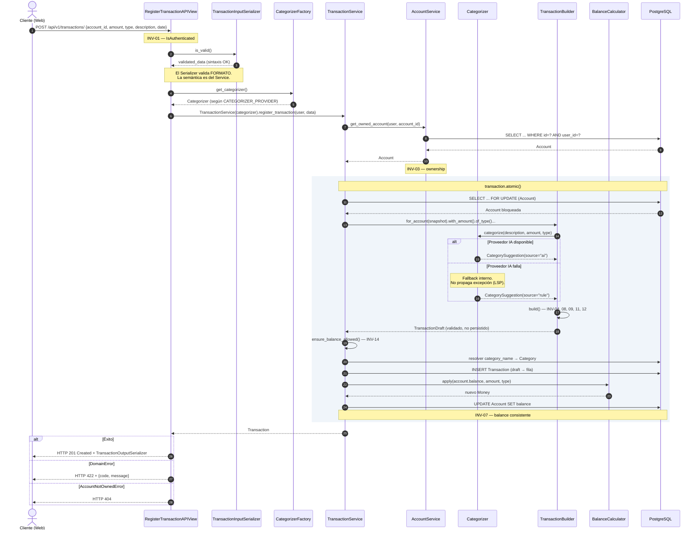
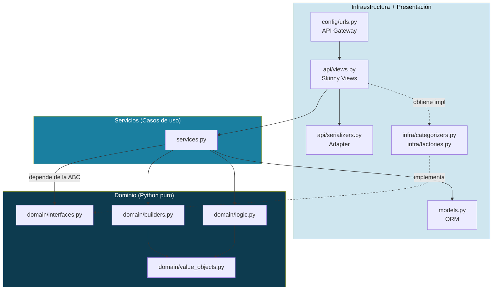

# Finty — Documentación Consolidada de Arquitectura y Dominio

**Versión:** 2.1
**Fecha:** 2026-08-23
**Estado:** Vigente — sustituye funcionalmente a los supuestos técnicos de Phase 0, Phase 1 y DDD Stage 1
**Cambios de v2.1:** correcciones derivadas de la implementación de los módulos M0–M5.1 (ver §0, filas C-11 a C-18)
**Alcance:** Documento único de referencia para la implementación en Django + Django REST Framework

> Este documento **no reemplaza** los artefactos de Service Design (Phase 0 / Phase 1) ni el Event Storming / Bounded Context Map (DDD Stage 1). Los **consume, corrige y traduce** al stack y a la doctrina arquitectónica definitivos. Donde exista contradicción entre este documento y los anteriores, **prevalece este**.

---

## 0. Registro de cambios respecto a v1

| # | Área | Estado en v1 | Estado en v2 | Motivo |
|---|------|--------------|--------------|--------|
| C-01 | Nombre del producto | Finova / Finova Web | **Finty** | Decisión de producto |
| C-02 | Stack backend | Python + FastAPI + PostgreSQL | **Python + Django + DRF + PostgreSQL** | Requisito del entregable |
| C-03 | Capa de dominio | Implícita, mezclada con supuestos ORM | **Capa `domain/` pura, sin imports de framework** | Portabilidad (Strangler Pattern) |
| C-04 | Lógica de negocio | Sin ubicación explícita | **Exclusivamente en `services.py` y `domain/`** | Penalización del 50% si aparece en `views.py` o en métodos de modelo |
| C-05 | Modelos | Entidades ricas (estilo DDD clásico) | **Modelos anémicos: solo persistencia** | Restricción explícita de la rúbrica |
| C-06 | Patrones creacionales | No definidos | **Factory + Builder asignados y justificados** | Requisito del entregable |
| C-07 | Capa de entrada | REST o GraphQL (indefinido) | **DRF: ViewSet para CRUD, APIView + Service para transacciones de negocio** | Criterio de Presentación 04 |
| C-08 | API Gateway | No contemplado | **Etapa 1: `urls.py` de Django; producción: Nginx; futuro: Kong/KrakenD** | Requisito de la Wiki |
| C-09 | Alcance de implementación | 100% conceptual | **Corte del 50–60% del diagrama de clases** | Definición de la Entrega 1 |
| C-10 | Invariantes | Clasificadas por capa abstracta | **Mapeadas a mecanismos concretos de Django/DRF** | Ejecutabilidad |
| C-11 | Retorno de `TransactionBuilder.build()` | Devolvía `Transaction` (modelo) | **Devuelve `TransactionDraft`** (objeto de valor) | Un builder en `domain/` que importe modelos arrastra el ORM al núcleo por transitividad y rompe el ADR-01 |
| C-12 | Entrada del builder | Recibía `Account` (modelo) | **Recibe `AccountSnapshot`** (objeto de valor) | Misma razón que C-11, en sentido de entrada |
| C-13 | Invariantes | 13 | **14** — se formaliza INV-14 | El catálogo DDD anotaba `balance >= 0 (dependiendo tipo)` sin identificador |
| C-14 | `Transaction` | Sin registro de confianza | **Campo `categorization_confidence`** | Phase 0 exige explicabilidad con indicadores de confianza (mitigación de R-02) |
| C-15 | Tipos enumerados del dominio | `@dataclass(frozen=True)` | **`enum.StrEnum`** | Inmutabilidad y conjunto cerrado por construcción; `.value` mapea directo a los `choices` del ORM |
| C-16 | Cliente de IA | Implícitamente asumido | **Costura inyectada, sin implementación concreta** | Sin dependencias de red ni claves de API en el entregable; el respaldo determinista queda demostrado en código |
| C-17 | Formulación de INV-07 | `balance = SUM(transacciones)` | **`balance = opening_balance + SUM(transacciones)`** | La fórmula original asumía tácitamente que toda cuenta abre en cero; con saldo de apertura, recalcular desde cero destruye dinero |
| C-18 | Acceso a cuenta ajena | `AccountNotOwnedError` (403) | **`AccountNotFoundError` (404) en ambos casos** | Un 403 confirmaría que ese identificador existe en el sistema |

---

## 1. Identidad del producto (actualizada)

| Campo | Valor |
|-------|-------|
| **Nombre** | Finty |
| **One-liner** | Finty ayuda a las personas a gestionar sus finanzas mediante seguimiento estructurado, insights automáticos y guía de decisión explicable |
| **Tipo** | Aplicación web B2C, desktop-first, SaaS |
| **Modelo de negocio** | Freemium + suscripción |
| **Ambición IA** | AI-augmented (la IA mejora un producto que funciona sin ella) |
| **Backend** | Python 3.12 · Django 5.x · Django REST Framework |
| **Base de datos** | PostgreSQL |
| **Frontend** | Desacoplado, consume JSON (headless) |
| **Autenticación** | Token / JWT vía DRF |

**Restricción arquitectónica no negociable:** la IA es **opcional en tiempo de ejecución**. Toda funcionalidad AI-powered debe tener fallback determinístico. Esto viene de Phase 0 (decisión "AI-augmented") y es lo que justifica el patrón Factory en la Sección 6.

---

## 2. Decisiones arquitectónicas (ADR)

### ADR-01 — Django + DRF como framework de la capa externa

**Contexto:** el catálogo de dominio original asumía FastAPI.
**Decisión:** se adopta Django + DRF.
**Consecuencia:** la capa de dominio documentada en DDD Stage 1 (entidades, value objects, invariantes) **se conserva íntegra** porque no depende del framework. Solo se re-expresa la capa externa. Esto es precisamente la propiedad que la arquitectura por capas promete: cambiar de framework debe tocar únicamente el anillo más externo.
**Estado:** aceptada.

### ADR-02 — Arquitectura de tres anillos

```
┌─────────────────────────────────────────────┐
│  Infraestructura + Presentación             │  ← views.py, serializers.py, urls.py,
│                                             │     models.py (ORM), infra/
│  ┌───────────────────────────────────────┐  │
│  │  Servicios (Casos de uso)             │  │  ← services.py
│  │                                       │  │
│  │  ┌─────────────────────────────────┐  │  │
│  │  │  Dominio                        │  │  │  ← domain/ (Python puro)
│  │  │  Entidades, VOs, reglas         │  │  │
│  │  └─────────────────────────────────┘  │  │
│  └───────────────────────────────────────┘  │
└─────────────────────────────────────────────┘
```

**Regla de dependencia:** las flechas apuntan hacia adentro. `domain/` no importa nada de Django. `services.py` puede importar `domain/` y `models.py`. `views.py` solo importa `services.py` y `serializers.py`.

**Verificación mecánica:** `grep -r "django" finance/domain/` debe devolver cero resultados. Este check se documenta como criterio de aceptación.

### ADR-03 — Modelos anémicos

**Decisión:** `models.py` contiene únicamente campos, `Meta`, constraints de base de datos, relaciones y `__str__`. **Ningún método de negocio.**

**Justificación:** la rúbrica penaliza con el 50% de la sección la presencia de lógica de negocio en métodos de modelo. Adicionalmente, un modelo con lógica ata esa lógica al ORM de Django y rompe la portabilidad prometida en ADR-01.

**Contrapartida aceptada:** se sacrifica el "modelo rico" clásico de DDD. Las invariantes de entidad se hacen cumplir en `domain/` y en los Builders, y se replican como constraints de base de datos cuando aplica (defensa en profundidad).

**Prohibido explícitamente:**
- `Account.recalculate_balance()`
- `Transaction.save()` con lógica sobreescrita
- `Model.clean()` con reglas de negocio
- Signals (`post_save`) que ejecuten reglas de negocio

### ADR-04 — Estructura de carpetas

```
finty/
├── manage.py
├── requirements.txt
├── .env.example
│
├── config/                        # Proyecto Django
│   ├── settings.py
│   ├── urls.py                    # ← API Gateway de Etapa 1
│   ├── asgi.py
│   └── wsgi.py
│
├── core/                          # Compartido entre contextos
│   ├── domain/
│   │   ├── value_objects.py       # Money
│   │   └── exceptions.py          # DomainError y subclases
│   └── api/
│       └── exception_handler.py   # DomainError → HTTP status
│
├── identity/                      # UserIdentityContext
│   ├── models.py                  # User, UserProfile
│   ├── services.py                # ProfileService
│   ├── api/
│   │   ├── serializers.py
│   │   ├── views.py
│   │   └── urls.py
│   └── tests/
│
└── finance/                       # FinancialDataContext
    ├── domain/
    │   ├── interfaces.py          # Categorizer (ABC)
    │   ├── value_objects.py       # AccountType, TransactionType, CategorySuggestion
    │   ├── logic.py               # BalanceCalculator, TransactionRules
    │   └── builders.py            # TransactionBuilder, AccountBuilder
    ├── infra/
    │   ├── categorizers.py        # AICategorizer, RuleBasedCategorizer, MockCategorizer
    │   └── factories.py           # CategorizerFactory
    ├── models.py                  # Account, Transaction, Category
    ├── services.py                # AccountService, TransactionService
    ├── api/
    │   ├── serializers.py
    │   ├── views.py
    │   └── urls.py
    └── tests/
```

**Justificación de las desviaciones respecto al árbol de la Presentación 02:**

| Desviación | Razón |
|------------|-------|
| `domain/builders.py` (archivo nuevo) | Los Builders son lógica de construcción de dominio, no infraestructura. Ubicarlos en `domain/` mantiene la regla de dependencia. |
| `infra/categorizers.py` en vez de `gateways.py` | Nombre semánticamente preciso: en Finty el adaptador externo no es una pasarela de pago sino un clasificador. La pasarela de pago aparecerá en `subscription/infra/gateways.py` en la Entrega 2. |
| `api/` como subpaquete | Separa el contrato REST del resto del app; facilita añadir un segundo contrato (GraphQL, gRPC) sin reorganizar. |
| `core/` transversal | `Money` y las excepciones de dominio se comparten entre contextos; duplicarlas rompería DRY y el lenguaje ubicuo. |

### ADR-05 — ViewSet vs APIView

Criterio: *¿la operación solo lee/escribe filas, o ejecuta reglas de negocio?*

| Endpoint | Clase DRF | Razón |
|----------|-----------|-------|
| `/api/v1/categories/` | `ModelViewSet` (read-only) | Catálogo de soporte, sin reglas |
| `/api/v1/accounts/` | `ModelViewSet` + Service en `perform_create` | CRUD con una regla (ownership) |
| `/api/v1/transactions/` (POST) | **`APIView` + Service** | Orquesta Factory + Builder + recálculo de balance + transacción atómica |
| `/api/v1/transactions/{id}/categorize/` | **`APIView` + Service** | Regla de negocio (INV-08) y reclasificación |
| `/api/v1/profile/` | `APIView` | Lectura/escritura simple con validación semántica |

Tener ambos tipos en el mismo proyecto es evidencia de criterio arquitectónico, no de dogma.

### ADR-06 — API Gateway por etapas

| Etapa | Rol del Gateway | Tecnología | Estado |
|-------|-----------------|------------|--------|
| **Hoy (Entrega 1)** | Enrutamiento y punto de entrada único | `config/urls.py` de Django + DRF | Implementado |
| **Producción (Entrega 2)** | Proxy inverso, TLS, rate limiting | Nginx | Planeado |
| **Escala (Horizonte 3)** | Auth centralizada, agregación, circuit breaker | Kong / AWS API Gateway / KrakenD | Futuro |

Las cuatro funciones críticas y su realización en Finty se detallan en la Sección 10.

---

## 3. Mapa de Bounded Contexts (actualizado)

| Contexto | App Django | Tipo | Sistema de registro | Entrega 1 |
|----------|-----------|------|---------------------|-----------|
| UserIdentityContext | `identity` | Generic | Sí | ✅ Parcial |
| FinancialDataContext | `finance` | **Core** | Sí | ✅ Completo |
| AnalyticsInsightsContext | `analytics` | Core | No | ⛔ Entrega 2 |
| RecommendationContext | `recommendation` | Core | No | ⛔ Entrega 2 |
| SubscriptionBillingContext | `subscription` | Supporting | Sí | ⛔ Entrega 2 |

**Relaciones vigentes en la Entrega 1:**

```
[identity] --(Customer-Supplier)--> [finance]
```

`finance` consume la identidad del usuario autenticado (`request.user`). No hay acoplamiento inverso: `identity` no conoce cuentas ni transacciones.

**Cambio respecto a v1:** la relación `RecommendationContext --(Conformist)--> FinancialDataContext` queda **fuera de alcance** y se revisará en la Entrega 2, porque introduce una dependencia circular en el mapa que conviene resolver con eventos de dominio y no con llamada directa.

---

## 4. Corte de alcance de la Entrega 1

### 4.1 Criterio del corte

Se implementa el **camino crítico completo de extremo a extremo** en lugar de fragmentos de muchos contextos. Esto permite:

1. Demostrar el flujo APIView → Serializer → Service → Factory → Builder → Dominio → Persistencia sin simulaciones.
2. Concentrar los tres patrones creacionales en un mismo recorrido narrable.
3. Ejercitar invariantes de los cuatro tipos de capa (Middleware, App, Domain, DB).

### 4.2 Inventario del diagrama de clases completo

| # | Clase | Contexto | Entrega 1 |
|---|-------|----------|-----------|
| 1 | `User` | identity | ✅ |
| 2 | `UserProfile` | identity | ✅ |
| 3 | `Account` | finance | ✅ |
| 4 | `Transaction` | finance | ✅ |
| 5 | `Category` | finance | ✅ |
| 6 | `Money` (VO) | core | ✅ |
| 7 | `AccountType` (VO) | finance | ✅ |
| 8 | `TransactionType` (VO) | finance | ✅ |
| 9 | `CategorySuggestion` (VO) | finance | ✅ |
| 10 | `Categorizer` (ABC) | finance | ✅ |
| 11 | `BalanceCalculator` | finance | ✅ |
| 12 | `Insight` | analytics | ⛔ |
| 13 | `SpendingPattern` | analytics | ⛔ |
| 14 | `Dashboard` | analytics | ⛔ |
| 15 | `Recommendation` | recommendation | ⛔ |
| 16 | `RiskProfile` | recommendation | ⛔ |
| 17 | `InvestmentPlan` | recommendation | ⛔ |
| 18 | `Subscription` | subscription | ⛔ |
| 19 | `SubscriptionPlan` | subscription | ⛔ |
| 20 | `Payment` | subscription | ⛔ |

**Cobertura: 11 de 20 clases = 55%.** Dentro del rango 50–60% exigido.

### 4.2.1 Clases de soporte arquitectónico

Durante la implementación aparecieron cuatro clases adicionales que **no forman parte del modelo de dominio del mapa de bounded contexts** y por tanto no entran al denominador de la cobertura. Existen para sostener la frontera entre capas:

| Clase | Ubicación | Función |
|-------|-----------|---------|
| `CategorizationSource` | `finance/domain/value_objects.py` | Enumeración del origen de una categorización (`ai` / `rule` / `manual`) |
| `TransactionDraft` | `finance/domain/value_objects.py` | Salida validada de `TransactionBuilder`; cruza del dominio hacia la persistencia |
| `AccountDraft` | `finance/domain/value_objects.py` | Salida validada de `AccountBuilder` |
| `AccountSnapshot` | `finance/domain/value_objects.py` | Lectura inmutable de la raíz de agregado que entra al dominio desde la persistencia |

Los drafts y el snapshot son las dos direcciones de la misma frontera: el snapshot entra al dominio, el draft sale. Ninguno conoce el ORM.

Tampoco entran al denominador los builders, la factory, los categorizadores concretos ni los servicios: son mecanismos de construcción y orquestación, no conceptos del lenguaje ubicuo.

### 4.3 Fuera de alcance, declarado

- Analítica, insights y detección de patrones.
- Motor de recomendaciones y perfil de riesgo.
- Suscripciones, pagos y feature gating (INV-05, INV-06 quedan diferidas).
- Integraciones bancarias automáticas (ya estaba fuera de alcance desde Phase 0).

---

## 5. Modelo de dominio actualizado

### 5.1 Aggregate: `Account`

`Account` es la raíz de agregado y el punto de consistencia del balance. `Transaction` es una entidad **dentro** del agregado: no se modifica sin pasar por la raíz.

**Consecuencia práctica en Django:** toda escritura de transacciones ocurre dentro de `transaction.atomic()` con `select_for_update()` sobre la fila de `Account`, para que INV-07 (balance consistente) se sostenga bajo concurrencia.

### 5.2 Entidades

#### `Account` (Aggregate Root)

| Atributo | Tipo Django | Requerido | Validación |
|----------|-------------|-----------|------------|
| `id` | `UUIDField(primary_key)` | Sí | Automático |
| `user` | `ForeignKey(User, PROTECT)` | Sí | INV-03 |
| `name` | `CharField(120)` | Sí | No vacío |
| `type` | `CharField(choices=AccountType)` | Sí | Enum válido |
| `opening_balance` | `DecimalField(14,2)` | Sí | Saldo al abrir la cuenta; inmutable tras la creación |
| `balance` | `DecimalField(14,2)` | Sí | Derivado, persistido (INV-07) |
| `currency` | `CharField(3)` | Sí | Default `COP` |
| `is_archived` | `BooleanField` | Sí | Default `False` |
| `created_at` | `DateTimeField(auto_now_add)` | Sí | Automático |

**Ciclo de vida:** `Active → Archived`. La transición inversa está prohibida (requiere decisión de negocio, no está implementada).

**Decisión sobre `balance`:** persistido y recalculado por `BalanceCalculator`, no derivado en cada lectura. Motivo: el producto es dashboard-céntrico y desktop-first con alta densidad de información (Phase 0, PI-02); recalcular por agregación en cada carga de dashboard degradaría el p95 < 2 s exigido por SC-05.

#### `Transaction` (Entidad dentro del agregado)

| Atributo | Tipo Django | Requerido | Validación |
|----------|-------------|-----------|------------|
| `id` | `UUIDField(primary_key)` | Sí | Automático |
| `account` | `ForeignKey(Account, PROTECT)` | Sí | INV-02 |
| `amount` | `DecimalField(14,2)` | Sí | INV-04 (`!= 0`) |
| `type` | `CharField(choices=TransactionType)` | Sí | INV-09 |
| `category` | `ForeignKey(Category, PROTECT, null=True)` | No | INV-08 tras categorizar |
| `description` | `CharField(255)` | No | — |
| `occurred_on` | `DateField` | Sí | No futura |
| `categorization_source` | `CharField(choices, null=True)` | No | `ai` / `rule` / `manual` |
| `categorization_confidence` | `FloatField(null=True)` | No | `0.0 ≤ x ≤ 1.0` (constraint DB) |
| `created_at` | `DateTimeField(auto_now_add)` | Sí | Automático |

**Ciclo de vida:** `Created → Categorized`. El estado `IncludedInAggregation` del modelo v1 **se elimina del alcance de la Entrega 1** porque pertenece a `AnalyticsInsightsContext`.

#### `Category`

Catálogo global de solo lectura en la Entrega 1. `Categorizer` devuelve el nombre de una categoría existente; no crea categorías nuevas.

| Atributo | Tipo Django |
|----------|-------------|
| `id` | `UUIDField(primary_key)` |
| `name` | `CharField(80, unique)` |
| `applies_to` | `CharField(choices=TransactionType)` |

**Decisión pendiente de v1 resuelta:** se inicia con categorías **globales**, no por usuario. La evolución a `UserCategory` queda documentada como deuda.

#### `UserProfile`

| Atributo | Tipo Django |
|----------|-------------|
| `user` | `OneToOneField(User, CASCADE)` |
| `display_name` | `CharField(120)` |
| `preferred_currency` | `CharField(3)` |
| `onboarding_completed` | `BooleanField` |

### 5.3 Value Objects

| VO | Ubicación | Atributos | Igualdad | Validación |
|----|-----------|-----------|----------|------------|
| `Money` | `core/domain/value_objects.py` | `amount: Decimal`, `currency: str` | Por valor y moneda | 2 decimales; operaciones entre monedas distintas lanzan `CurrencyMismatchError` |
| `AccountType` | `finance/domain/value_objects.py` | `value` | Por valor | ∈ {`cash`, `bank`, `credit`} |
| `TransactionType` | `finance/domain/value_objects.py` | `value` | Por valor | ∈ {`income`, `expense`} |
| `CategorySuggestion` | `finance/domain/value_objects.py` | `category_name`, `confidence`, `source` | Por valor | `0.0 ≤ confidence ≤ 1.0` |

Todos se implementan como `@dataclass(frozen=True)` — inmutabilidad real, sin dependencia de Django.

**`CategorySuggestion` es nuevo en v2.** Es el contrato de retorno de `Categorizer` y lo que hace posible el LSP: cualquier implementación devuelve el mismo VO, incluida la que falla silenciosamente.

---

## 6. Patrones creacionales: asignación y justificación

### 6.1 Factory Method → `CategorizerFactory`

**Problema que resuelve:** la categorización de transacciones puede ejecutarse con un modelo de IA, con reglas determinísticas, o con un mock en desarrollo. Instanciar directamente el categorizador en el Service o en la View lo ataría a una implementación concreta y violaría OCP y DIP.

**Solución:**

```
domain/interfaces.py     Categorizer (ABC) con un único método
                         categorize(description, amount, type) -> CategorySuggestion

infra/categorizers.py    AICategorizer         → llama al proveedor externo
                         RuleBasedCategorizer  → diccionario de palabras clave
                         MockCategorizer       → categoría fija, para tests

infra/factories.py       CategorizerFactory.get_categorizer()
                         lee CATEGORIZER_PROVIDER desde el entorno
```

**Ventaja operativa demostrable:**

```bash
export CATEGORIZER_PROVIDER=MOCK && python manage.py runserver
```

cambia el comportamiento del sistema sin tocar una línea de código. Esto además evita consumir cuota de inferencia durante desarrollo, lo cual conecta directamente con la restricción HC-06 de Phase 0 (presupuesto limitado de IA).

**Por qué esta Factory y no la de pagos:** el `PaymentGatewayFactory` es el ejemplo más obvio, pero `SubscriptionBillingContext` está fuera del corte del 50–60%. El `CategorizerFactory` es funcionalmente equivalente en estructura, está dentro del alcance, y responde a una restricción real del producto (fallback determinístico obligatorio) en lugar de a una hipótesis futura.

**Fallback y LSP:** `AICategorizer` nunca propaga excepciones hacia arriba. Si el proveedor externo falla, delega internamente en `RuleBasedCategorizer` y devuelve un `CategorySuggestion` con `source="rule"` y confianza reducida. El contrato se mantiene: el Service no necesita saber qué ocurrió.

### 6.2 Builder → `TransactionBuilder`

**Problema que resuelve:** crear una `Transaction` válida requiere coordinar cuenta, monto, tipo, categoría resuelta, fecha, origen de la categorización y el efecto sobre el balance de la cuenta. Un constructor posicional con siete argumentos es exactamente el antipatrón descrito en la Presentación 03: inconsistente, con alta carga cognitiva y lógica dispersa.

**Solución — interfaz fluida:**

```python
draft = (
    TransactionBuilder()
    .for_account(snapshot)            # AccountSnapshot, no el modelo
    .with_amount(Money(amount, currency))
    .of_type(TransactionType.EXPENSE)
    .occurred_on(day)
    .described_as(description)
    .categorized_by(categorizer)      # opcional: dispara la categorización
    .build()                          # ← aquí ocurren TODAS las validaciones
)
```

`build()` devuelve un `TransactionDraft`, no un modelo. Es la corrección C-11: un builder alojado en `domain/` que importara `finance.models` arrastraría el ORM al núcleo por transitividad, y el `grep` de pureza no lo detectaría porque la cadena `django` no aparecería en el archivo. El draft mantiene el dominio genuinamente portable; el servicio traduce draft → fila.

`build()` es **de un solo uso**: la segunda llamada falla. El categorizador se invoca durante `build()`, y permitir reconstrucciones dispararía llamadas repetidas a un colaborador externo. `AccountBuilder` no tiene esa restricción porque no invoca a nadie.

**Qué garantiza `.build()`:**

| Garantía | Invariante |
|----------|------------|
| Campos obligatorios presentes | — |
| Monto distinto de cero | INV-04 |
| Monto no negativo (el signo lo aporta `type`) | — |
| Tipo dentro del enum | INV-09 |
| Cuenta no archivada | — |
| Moneda de la transacción == moneda de la cuenta | INV-11 |
| Fecha no futura | INV-12 |
| Categoría resuelta si se invocó `categorized_by` | INV-08 |

**Qué NO garantiza:** INV-14 (balance resultante admisible). El saldo autoritativo vive en la base y solo es confiable bajo bloqueo; el snapshot es, por definición, una foto que puede quedar obsoleta. Esa verificación pertenece al servicio, después del `select_for_update()`. En `AccountBuilder` sí se verifica INV-14, porque en la creación el saldo inicial es el único dato en juego y no existe carrera posible.

**Beneficio arquitectónico:** el objeto solo existe cuando está completo y es válido. La lógica de armado no se filtra ni a la Vista ni al Servicio; el Servicio orquesta, el Builder construye.

**Segundo Builder:** `AccountBuilder`, más simple, para la creación de cuentas con balance inicial. Se incluye para demostrar que el patrón no es un caso aislado forzado.

### 6.3 Service Layer

| Servicio | Método | Orquesta |
|----------|--------|----------|
| `AccountService` | `create_account(user, data)` | `AccountBuilder` → persistencia |
| | `get_owned_account(user, account_id)` | INV-03; consulta filtrada por usuario, lanza `AccountNotFoundError` tanto si no existe como si es ajena (C-18) |
| | `get_locked_account(user, account_id)` | Igual, con `select_for_update()`; solo válido dentro de un bloque atómico |
| | `build_snapshot(account)` | Único punto donde una fila se convierte en objeto de dominio |
| | `archive_account(user, account_id)` | Archiva aunque haya transacciones; lo protegido es borrar, no archivar |
| | `recompute_balance(user, account_id)` | `opening_balance + recompute(movimientos)`; operación de reparación |
| `TransactionService` | `register_transaction(user, data)` | **Flujo completo**: ownership → Factory → Builder → atomic → BalanceCalculator |
| | `recategorize(user, transaction_id, category)` | Reclasificación manual, INV-08 |
| `ProfileService` | `complete_profile(user, data)` | Validación semántica del perfil |

**Inyección de dependencias:** el categorizador entra por constructor.

```python
class TransactionService:
    def __init__(self, categorizer: Categorizer):
        self._categorizer = categorizer
```

La View no decide qué categorizador usar; pide uno a la Factory y lo inyecta. El Service depende de la abstracción, nunca de `AICategorizer`.

---

## 7. Catálogo de invariantes mapeado a Django

| ID | Invariante | Capa | Mecanismo concreto | Entrega 1 |
|----|-----------|------|--------------------|-----------|
| INV-01 | Usuario autenticado para operar | Middleware | `permission_classes = [IsAuthenticated]` en DRF | ✅ |
| INV-02 | Transacción pertenece a cuenta existente | DB | `ForeignKey(Account, on_delete=PROTECT, null=False)` | ✅ |
| INV-03 | Cuenta pertenece al usuario | Domain / Service | `AccountService.get_owned_account()`; querysets filtrados por `request.user` | ✅ |
| INV-04 | Monto de transacción distinto de cero | Domain + DB | `TransactionBuilder.build()` **y** `CheckConstraint(~Q(amount=0))` | ✅ |
| INV-05 | Pago exitoso antes de activar suscripción | App | — | ⛔ Entrega 2 |
| INV-06 | Premium requiere suscripción activa | Middleware | — | ⛔ Entrega 2 |
| INV-07 | Balance consistente: `balance = opening_balance + Σ movimientos` | Domain | `BalanceCalculator` dentro de `transaction.atomic()` + `select_for_update()` | ✅ |
| INV-08 | Categoría obligatoria tras procesamiento | Domain | `TransactionBuilder.build()` exige categoría si se invocó categorización | ✅ |
| INV-09 | Tipo de transacción válido | DB | `TextChoices` + `CheckConstraint` | ✅ |
| INV-10 | Email único por usuario | DB | `unique=True` en el modelo de usuario | ✅ |
| **INV-11** | Moneda de transacción == moneda de cuenta | Domain | `Money.__add__` lanza `CurrencyMismatchError`; verificado en `.build()` | ✅ **Nueva** |
| **INV-12** | Fecha de transacción no futura | Domain | Validación en `.build()` | ✅ **Nueva** |
| **INV-13** | No se elimina cuenta con transacciones | DB | `on_delete=PROTECT` | ✅ **Nueva** |
| **INV-14** | Cuenta que no admite saldo negativo no queda negativa | Domain | `AccountType.allows_negative_balance()` + `TransactionRules.ensure_balance_allowed()`, verificado en el servicio bajo bloqueo y en `AccountBuilder` al crear | ✅ **Nueva** |

**Nota sobre defensa en profundidad:** INV-04 y INV-09 aparecen en dos capas. La fuente autoritativa es el dominio; la constraint de base de datos es la red de seguridad ante escrituras que evadan la capa de servicios (migraciones de datos, shell de Django, procesos batch futuros). Esto es intencional y se documenta como tal, no es duplicación accidental.

**Las invariantes implícitas** detectadas en v1 se formalizan: "no eliminar cuentas con transacciones" pasa a ser INV-13; "fechas no futuras" pasa a ser INV-12.

---

## 8. Evidencia de SOLID

| Principio | Dónde se evidencia en Finty | Verificación |
|-----------|----------------------------|--------------|
| **SRP** | `views.py` solo traduce HTTP. `serializers.py` solo valida sintaxis y formato. `services.py` solo orquesta casos de uso. `domain/` solo contiene reglas. `models.py` solo persiste. | Ninguna clase tiene dos razones para cambiar. Cambiar el cálculo de balance no toca la Vista. |
| **OCP** | Añadir un `LLMCategorizerV2` requiere: crear la clase + una línea en la Factory. **Cero cambios** en `TransactionService`, `views.py` o `serializers.py`. | El Service está cerrado a modificación, abierto a extensión. |
| **LSP** | `AICategorizer`, `RuleBasedCategorizer` y `MockCategorizer` son sustituibles sin romper el sistema: todas cumplen el contrato de devolver un `CategorySuggestion` y ninguna propaga excepciones. | Los tests del Service se ejecutan idénticos con las tres implementaciones. |
| **ISP** | `Categorizer` expone **un solo método**. No se obliga a `MockCategorizer` a implementar métodos de configuración de API, timeouts o reintentos que no usa. | Interfaz mínima. |
| **DIP** | `TransactionService.__init__(categorizer: Categorizer)` depende de la ABC de `domain/`, no de la implementación de `infra/`. La dirección de la dependencia se invierte respecto al flujo de control. | `finance/domain/` no importa nada de `finance/infra/`. |

---

## 9. Diagramas

### 9.1 Diagrama de clases — alcance Entrega 1

```mermaid
classDiagram
    direction TB

    %% ============ CAPA DOMINIO ============
    class Money {
        <<Value Object>>
        +Decimal amount
        +str currency
        +add(other) Money
        +negate() Money
        +is_zero() bool
    }

    class AccountType {
        <<Value Object>>
        +str value
        +CASH$
        +BANK$
        +CREDIT$
    }

    class TransactionType {
        <<Value Object>>
        +str value
        +INCOME$
        +EXPENSE$
    }

    class CategorySuggestion {
        <<Value Object>>
        +str category_name
        +float confidence
        +CategorizationSource source
        +is_confident(threshold) bool
    }

    class CategorizationSource {
        <<Value Object>>
        +AI$
        +RULE$
        +MANUAL$
    }

    class AccountSnapshot {
        <<Value Object>>
        +UUID account_id
        +str currency
        +AccountType account_type
        +bool is_archived
        +Money balance
    }

    class TransactionDraft {
        <<Value Object>>
        +UUID account_id
        +Money amount
        +TransactionType transaction_type
        +date occurred_on
        +str description
        +str category_name
        +CategorizationSource categorization_source
        +float confidence
        +signed_amount() Money
    }

    class AccountDraft {
        <<Value Object>>
        +UUID user_id
        +str name
        +AccountType account_type
        +Money initial_balance
    }

    class Categorizer {
        <<interface>>
        +categorize(description, amount, type)* CategorySuggestion
    }

    class BalanceCalculator {
        <<Domain Service>>
        +apply(balance, amount, type)$ Money
        +recompute(transactions)$ Money
    }

    class TransactionBuilder {
        <<Builder>>
        -_account
        -_amount
        -_type
        -_category
        -_occurred_on
        +for_account(account) TransactionBuilder
        +with_amount(money) TransactionBuilder
        +of_type(type) TransactionBuilder
        +occurred_on(date) TransactionBuilder
        +described_as(text) TransactionBuilder
        +categorized_by(categorizer) TransactionBuilder
        +build() TransactionDraft
    }

    class AccountBuilder {
        <<Builder>>
        +for_user(user) AccountBuilder
        +named(name) AccountBuilder
        +of_type(type) AccountBuilder
        +with_initial_balance(money) AccountBuilder
        +build() AccountDraft
    }

    %% ============ CAPA INFRAESTRUCTURA ============
    class AICategorizer {
        -_client
        -_fallback
        +categorize(...) CategorySuggestion
    }

    class RuleBasedCategorizer {
        -_keyword_map
        +categorize(...) CategorySuggestion
    }

    class MockCategorizer {
        +categorize(...) CategorySuggestion
    }

    class CategorizerFactory {
        <<Factory>>
        +get_categorizer()$ Categorizer
    }

    %% ============ CAPA SERVICIOS ============
    class AccountService {
        <<Service>>
        +create_account(user, data) Account
        +get_owned_account(user, id) Account
        +archive_account(user, id) Account
    }

    class TransactionService {
        <<Service>>
        -_categorizer Categorizer
        +register_transaction(user, data) Transaction
        +recategorize(user, id, category) Transaction
    }

    class ProfileService {
        <<Service>>
        +complete_profile(user, data) UserProfile
    }

    %% ============ CAPA PERSISTENCIA ============
    class User {
        <<Model>>
        +UUID id
        +str email
        +str password
    }

    class UserProfile {
        <<Model>>
        +User user
        +str display_name
        +str preferred_currency
        +bool onboarding_completed
    }

    class Account {
        <<Model — Aggregate Root>>
        +UUID id
        +User user
        +str name
        +str type
        +Decimal balance
        +str currency
        +bool is_archived
    }

    class Transaction {
        <<Model>>
        +UUID id
        +Account account
        +Decimal amount
        +str type
        +Category category
        +str description
        +date occurred_on
        +str categorization_source
    }

    class Category {
        <<Model>>
        +UUID id
        +str name
        +str applies_to
    }

    %% ============ RELACIONES ============
    User "1" -- "1" UserProfile
    User "1" -- "*" Account
    Account "1" o-- "*" Transaction : aggregate
    Category "1" -- "*" Transaction

    Categorizer <|.. AICategorizer
    Categorizer <|.. RuleBasedCategorizer
    Categorizer <|.. MockCategorizer
    AICategorizer --> RuleBasedCategorizer : fallback
    CategorizerFactory ..> Categorizer : creates

    TransactionService --> Categorizer : injected
    TransactionService ..> TransactionBuilder : uses
    TransactionService ..> BalanceCalculator : uses
    TransactionService ..> TransactionDraft : persists
    TransactionService ..> AccountSnapshot : builds from ORM
    AccountService ..> AccountDraft : persists
    AccountService ..> AccountBuilder : uses

    TransactionBuilder ..> TransactionDraft : builds
    TransactionBuilder ..> AccountSnapshot : consumes
    TransactionBuilder ..> Money : validates
    TransactionBuilder ..> TransactionType : validates
    AccountBuilder ..> AccountDraft : builds
    AccountBuilder ..> AccountType : validates

    Categorizer ..> CategorySuggestion : returns
    CategorySuggestion ..> CategorizationSource : uses
    BalanceCalculator ..> Money : operates
    ProfileService ..> UserProfile : manages
```



### 9.2 Diagrama de secuencia — Registrar transacción (flujo más complejo)



### 9.3 Diagrama de capas y dependencias



---

## 10. Estrategia de API Gateway

### 10.1 Las cuatro funciones críticas aplicadas a Finty

| Función | Realización en Etapa 1 | Realización futura |
|---------|------------------------|--------------------|
| **Autenticación / Autorización** | `IsAuthenticated` de DRF, validado en cada APIView | Validación de JWT una sola vez en la entrada del Gateway |
| **Rate limiting** | `DEFAULT_THROTTLE_RATES` de DRF | Nginx `limit_req` / plugin de Kong |
| **Abstracción (routing)** | `config/urls.py` incluye `identity/api/urls.py` y `finance/api/urls.py`; el cliente solo conoce `/api/v1/` | El Gateway redirige a servicios internos sin que el cliente conozca su ubicación física |
| **Agregación de datos** | No aplica: monolito, una sola llamada | El dashboard consolidado de Finty pedirá en una llamada datos de `finance` + `analytics` + `subscription` |

### 10.2 Contrato de rutas — Entrega 1

```
/api/v1/
├── auth/
│   ├── register/          POST    → registro
│   └── login/             POST    → token
├── profile/               GET,PUT → perfil del usuario autenticado
├── accounts/              GET,POST
│   ├── {id}/              GET,PUT,DELETE
│   └── {id}/archive/      POST    → archivar (no borra)
├── categories/            GET     → catálogo (read-only)
│   └── {id}/              GET
└── transactions/          GET,POST
    ├── {id}/              GET,DELETE
    └── {id}/categorize/   POST    → reclasificación manual
```

**Versionado desde el día 1 (`/api/v1/`):** cuando el Gateway de producción tenga que enrutar `/api/v2/transactions/` a un microservicio nuevo mientras `/api/v1/` sigue apuntando al monolito, el Strangler Pattern se aplica sin romper clientes.

---

## 11. Trazabilidad

### 11.1 Journeys To-Be → Features → Endpoints → Clases

| Journey (JN-TB) | Paso | Feature | Endpoint | Clases implicadas |
|-----------------|------|---------|----------|-------------------|
| JN-TB-01 | 1 | FT-001 Autenticación | `POST /auth/login/` | `User` |
| JN-TB-01 | 2 | FT-002 Dashboard | `GET /accounts/` | `Account`, `AccountService` |
| JN-TB-01 | 3 | FT-003 Categorización | `POST /transactions/` | `TransactionService`, `CategorizerFactory`, `Categorizer`, `TransactionBuilder` |
| JN-TB-01 | 4 | FT-004 Insights | — | ⛔ Entrega 2 |
| JN-TB-01 | 5 | FT-005 Recomendaciones | — | ⛔ Entrega 2 |
| JN-TB-02 | 2 | FT-003 Categorización | `POST /transactions/{id}/categorize/` | `TransactionService` |
| JN-TB-04 | 1–2 | FT-002 Dashboard | `GET /accounts/` | `Account`, `BalanceCalculator` |

**Cobertura de journeys en la Entrega 1:** los pasos de captura y consolidación de datos están cubiertos; los pasos de análisis y recomendación quedan explícitamente diferidos.

### 11.2 Patrón → Clase → Requisito de la rúbrica

| Requisito | Implementación | Archivo |
|-----------|----------------|---------|
| Service Layer | `TransactionService`, `AccountService`, `ProfileService` | `*/services.py` |
| Factory | `CategorizerFactory` | `finance/infra/factories.py` |
| Builder | `TransactionBuilder`, `AccountBuilder` | `finance/domain/builders.py` |
| Vistas sin lógica de negocio | Todas las views delegan | `*/api/views.py` |
| Modelos sin lógica de negocio | ADR-03 | `*/models.py` |
| Inversión de dependencias | `Categorizer` ABC inyectada | `finance/domain/interfaces.py` |

---

## 12. Glosario de lenguaje ubicuo (actualizado)

| Término de negocio | Contexto | Nombre en código | Tipo | Sinónimos prohibidos |
|--------------------|----------|------------------|------|---------------------|
| Cuenta | finance | `Account` | Modelo (Aggregate Root) | Wallet, BalanceAccount |
| Transacción | finance | `Transaction` | Modelo | Movement, Operation |
| Categoría | finance | `Category` | Modelo | Tag, Label |
| Tipo de cuenta | finance | `AccountType` | Value Object | AccountKind |
| Tipo de transacción | finance | `TransactionType` | Value Object | FlowType |
| Dinero | core | `Money` | Value Object | Amount (a secas) |
| Sugerencia de categoría | finance | `CategorySuggestion` | Value Object | Prediction, Guess |
| Clasificador | finance | `Categorizer` | Interfaz (ABC) | Classifier, Tagger |
| Calculadora de balance | finance | `BalanceCalculator` | Domain Service | BalanceHelper |
| Usuario | identity | `User` | Modelo | Client, Customer |
| Perfil de usuario | identity | `UserProfile` | Modelo | Profile (ambiguo con RiskProfile) |

**Polisemias resueltas y vigentes:**

| Término | Resolución |
|---------|-----------|
| `Plan` | `InvestmentPlan` vs `SubscriptionPlan` — ambos fuera de la Entrega 1 |
| `Profile` | `UserProfile` (identity) vs `RiskProfile` (recommendation) |
| `Transaction` | `Transaction` (movimiento financiero del usuario) vs `Payment` (pago de suscripción). **Nota crítica:** `django.db.transaction` también usa la palabra; en el código se importa como `from django.db import transaction as db_transaction` para evitar colisión de nombres. |

---

## 13. Deuda documental y decisiones pendientes

| # | Tema | Decisión provisional | A revisar en |
|---|------|---------------------|--------------|
| D-01 | Categorías globales vs. por usuario | Globales | Entrega 2 |
| D-02 | Balance persistido vs. calculado | Persistido, con recálculo transaccional | Cuando aparezca analytics |
| D-03 | Dependencia circular `Recommendation → FinancialData` | Fuera de alcance; se resolverá con eventos de dominio | Entrega 2 |
| D-04 | Multi-moneda real | Una moneda por cuenta; sin conversión | Post-MVP |
| D-05 | Eventos de dominio | No implementados; los contextos se comunican por llamada directa | Al añadir el segundo contexto Core |
| D-06 | Modelo de usuario | Se define `AbstractUser` propio desde el inicio | Cerrada — cambiar después es costoso |
| D-07 | Cliente concreto de IA | Costura inyectada sin implementación; `AICategorizer` opera degradado | Entrega 2 |
| D-08 | Enumeración de cuentas ajenas | `get_owned_account` devuelve 404 y no 403 para no revelar existencia | Cerrada |

---

## Anexo A — Criterios de aceptación verificables

| # | Criterio | Cómo se verifica |
|---|----------|------------------|
| A-01 | `domain/` no depende de Django | `grep -rn "django" finance/domain/ core/domain/` devuelve vacío |
| A-02 | Vistas sin lógica de negocio | Ninguna view contiene `if` sobre reglas de dominio, cálculos ni queries complejas |
| A-03 | Modelos sin lógica de negocio | `models.py` solo tiene campos, `Meta`, `__str__` |
| A-04 | Factory conmutable por entorno | `CATEGORIZER_PROVIDER=MOCK` cambia el comportamiento sin tocar código |
| A-05 | Builder valida antes de construir | Existe test que verifica que `.build()` con monto 0 lanza `DomainError` |
| A-06 | Balance consistente | Test que registra N transacciones y compara `account.balance` con la suma |
| A-07 | Ownership aplicado | Test que verifica que el usuario B no puede operar sobre la cuenta de A |
| A-08 | LSP en categorizadores | La suite de `TransactionService` pasa con las tres implementaciones |
| A-09 | Builder no conoce el ORM | `grep -rnE "finance\.(models\|infra)" finance/domain/` devuelve vacío |
| A-10 | Servicio no conoce implementaciones concretas | `grep -rnE "AICategorizer\|RuleBasedCategorizer\|MockCategorizer" finance/services.py` devuelve vacío |
| A-11 | Escritura bajo bloqueo | El SQL de `register_transaction` contiene `FOR UPDATE` |
| A-12 | Categoría emitida siempre existe | Test de contrato entre el mapa de reglas y la tabla `Category` |

---

*Finty · Documentación Consolidada v2.1 · 2026-08-23*
