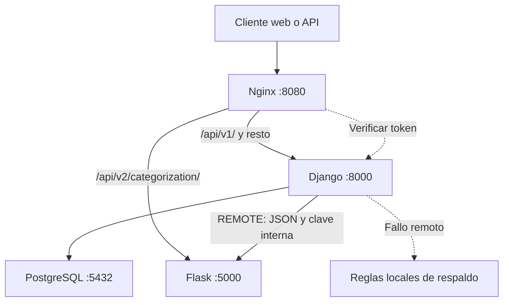

# Migración a Microservicios (Strangler Pattern)

**Proyecto:** Finty. **Taller:** 02, Arquitectura de Software 2026.
**Funcionalidad extraída:** sugerencia automática de categorías de transacciones.
**Base analizada:** `tsepulvedf/Finty`, commit `d19eb9d` (rama predeterminada al revisar).

## 1. Diagnóstico del monolito

Finty implementa tres apps: `core`, `identity` y `finance`. Django autentica al
usuario y persiste cuentas, movimientos y categorías en PostgreSQL. La operación
`TransactionService.register_transaction()` conserva el balance dentro de
`transaction.atomic()` con bloqueo `select_for_update()` de la cuenta.

La clasificación tiene una costura explícita: `Categorizer` en
`finance/domain/interfaces.py`. `CategorizerFactory` selecciona el adaptador y
el builder consume un `CategorySuggestion`. Las reglas actuales están en
`finance/infra/categorizers.py`, son Python puro y no consultan el ORM.

**No existe evidencia de saturación de CPU, timeouts ni bloqueo general del
monolito en el repositorio revisado.** El clasificador actual es un diccionario
de reglas, no un modelo de IA entrenado. La extracción se justifica como una
capacidad central del producto con bajo acoplamiento y evolución independiente;
la posibilidad de ejecutar inferencia pesada es futura, no una medición actual.

## 2. Matriz de decisión

Escala cualitativa de 1 a 5: **F** = frecuencia de cambio esperada;
**R** = consumo de recursos actual; **A** = acoplamiento técnico, donde 5 es alto.
Puntaje = `0.35 * F + 0.25 * R + 0.40 * (6 - A)`.
Se prioriza la facilidad de separar responsabilidades sin romper invariantes.
Los puntajes son juicio arquitectónico basado en código, no estadísticas de
commits ni resultados de un benchmark.

| Módulo existente | F | R | A | Puntaje | Evidencia y decisión |
|---|---:|---:|---:|---:|---|
| Identidad y autenticación | 2 | 2 | 5 | 1.60 | Tokens, usuarios y perfiles; referencia transversal desde cuentas. Mantener en Django. |
| Gestión de cuentas | 2 | 2 | 5 | 1.60 | Ownership, archivo y saldo inicial; raíz del agregado financiero. Mantener. |
| Registro de movimientos y balance | 3 | 3 | 5 | 2.20 | Atomicidad y bloqueo de cuenta; separar exige coordinación distribuida. Mantener. |
| Catálogo de categorías | 2 | 1 | 4 | 1.75 | Lectura liviana, FK desde movimientos y catálogo inicial. Mantener. |
| Clasificación automática | 4 | 1 | 1 | **3.65** | ABC estable, entradas/salida pequeñas, sin persistencia. **Extraer a Flask.** |

La frecuencia de cambio de reglas se estima mayor porque admite añadir palabras
clave y estrategias; no se presenta como una frecuencia histórica comprobada.
Aunque el consumo actual es bajo, la clasificación gana por su autonomía y por
evitar separar la transacción financiera. No se implementan módulos de reportes,
pagos ni recomendaciones: el repositorio los declara fuera de alcance.

## 3. Nueva arquitectura



Solo Nginx publica un puerto, ligado a `127.0.0.1`. Django, Flask y PostgreSQL
se comunican por la red de Compose. PostgreSQL es propiedad de Django; Flask
**no tiene credenciales de base de datos ni modelos del ORM**. La clasificación
es stateless, por lo que no requiere base de datos propia.

### Separación técnica

1. Flask recibe cuatro valores JSON y devuelve una sugerencia. No recibe
   `account_id`, `user_id`, token de usuario ni un objeto Django.
2. `services/categorization/business.py` valida y llama a las reglas; `app.py`
   adapta HTTP. La imagen Flask instala solo Flask y Gunicorn, sin Django.
3. La imagen copia los value objects puros y `finance/infra/categorizers.py`.
   Se reutiliza la misma implementación para evitar divergencia con el respaldo.
   El repositorio es compartido para construir imágenes, pero los procesos,
   dependencias de framework y despliegues son independientes. No hay un segundo
   ORM ni una base compartida por dos servicios.
4. `RemoteCategorizer` implementa la ABC original. Se agrega `REMOTE` a la
   factory; las views, builders, modelos y `TransactionService` no cambian.
5. Compose activa `REMOTE` para que el registro existente en v1 use Flask. Las
   categorías manuales siguen el camino original y no invocan el servicio.

La copia de contratos puros desde el monorepo introduce acoplamiento de build;
una evolución posterior podría versionarlos como paquete. No se afirma que
ambos proyectos tengan repositorios fuente totalmente independientes.

## 4. Contrato REST

**POST `/api/v2/categorization/`**

En el acceso público: `Authorization: Token <token de Django>` y
`Content-Type: application/json`. Nginx usa `auth_request` contra
`/api/v1/auth/verify/`; después sustituye `X-Service-Token` por una clave interna.
Flask comprueba esa clave. La llamada interna desde Django usa la misma clave.
La sonda interna `GET /healthz` no exige autenticación y no se publica como ruta
de Flask en Nginx.

Entrada:

```json
{"description":"almuerzo","amount":"25000.00","currency":"COP","type":"expense"}
```

Salida HTTP 200:

```json
{"category_name":"Alimentación","confidence":0.75,"source":"rule"}
```

`amount` viaja como cadena, conserva `Decimal` y admite hasta 12 enteros y 2
decimales. Debe ser positivo; `type` es `income` o `expense`; `description` admite
hasta 255 caracteres, incluso vacío. La moneda usa la regla de tres letras
ASCII del dominio; no se añade validación ISO distinta a la del monolito.
Se rechazan campos faltantes o adicionales y cuerpos que no sean objetos.

Errores de entrada HTTP 400:

```json
{"error":{"code":"INVALID_INPUT","message":"amount debe ser mayor que cero.","request_id":"uuid"}}
```

Los errores inesperados dan HTTP 500 con `code=INTERNAL_ERROR`, mensaje
genérico y `request_id`, sin exponer el detalle interno. JSON mal formado,
content type incorrecto, método incorrecto y payload excesivo también producen
errores JSON desde Flask (400/415/405/413). Límite del cuerpo: 16 KiB.
Nginx devuelve 401/403 en rechazos de autenticación y 503 estructurado si no
alcanza Flask. Las respuestas generadas por Nginx no tienen el mismo request ID
de Flask; 413/429 del proxy usan su formato predeterminado.

La sugerencia no guarda ni reclasifica un movimiento existente. La persistencia
continúa exclusivamente en v1. `source=rule` identifica el mecanismo, no el
framework; no se inventa una fuente `flask` ni una migración del modelo.

## 5. Enrutamiento con Nginx

Extracto de `infra/nginx/nginx.conf`:

```nginx
location /api/v1/ {
    proxy_pass http://django_backend;
}
location ^~ /api/v2/categorization/ {
    auth_request /_auth_verify;
    proxy_set_header X-Service-Token "${CATEGORIZATION_SERVICE_TOKEN}";
    proxy_set_header Authorization "";
    proxy_pass http://flask_backend;
}
```

`proxy_pass` sin URI final preserva `/api/v2/categorization/`, que coincide con
la ruta Flask. La variante sin barra final redirige con 308 conservando POST.
Las demás rutas, incluido el cliente web, siguen llegando a Django. No se
redirige indiscriminadamente todo `/api/v2/`.

El archivo es una plantilla de contexto HTTP montada en
`/etc/nginx/templates/default.conf.template`. La imagen oficial produce el
archivo de configuración de servidor. Se limita `envsubst` a la clave interna
para conservar `$host`, `$http_authorization` y las variables de Nginx.

## 6. Resiliencia, consistencia y rollback

El adaptador REST usa timeout de socket de 1 segundo por defecto, respuesta
máxima de 16 KiB y sin reintentos. Valida tipo de categoría, fuente y confianza.
Ante caída, timeout, JSON inválido o respuesta incompatible usa reglas locales
con confianza máxima 0.20 y fuente `rule`; no propaga excepciones al builder.
El timeout es de socket, no un plazo total estricto frente a respuestas lentas
en fragmentos. En la red interna confiable acota las esperas habituales.

Flask puede escalar por separado sin repartir la consistencia del balance.
El registro mantiene la transacción SQL y el bloqueo originales. **La llamada
remota ocurre dentro de ese bloqueo**, debido al builder original: añade espera
y puede aumentar contención. Esta implementación aísla la ejecución de reglas,
pero no vuelve asíncrono a Django. Una siguiente iteración podría calcular la
sugerencia antes del bloqueo y revalidar el snapshot dentro de la transacción.

Rollback: establecer `CATEGORIZER_PROVIDER=RULE` y recrear `django_web`. Así el
flujo v1 vuelve a ser completamente local sin revertir esquema ni datos.
Retirar la ruta v2 requiere coordinar a sus consumidores; no se promete
compatibilidad automática entre el contrato de sugerencia y el de registro.

## 7. Ejecución y verificación

Pasos completos en `docs/TALLER02.md`. Preparar `.env.docker` con tres secretos
propios y ejecutar desde la raíz:

```bash
docker compose --env-file .env.docker config --quiet
docker compose --env-file .env.docker up --build -d
docker compose --env-file .env.docker ps
docker compose --env-file .env.docker exec nginx nginx -t
python scripts/smoke_strangler.py
```

Prueba de resiliencia:

```bash
docker compose --env-file .env.docker stop flask_categorization
python scripts/smoke_strangler.py --fallback
docker compose --env-file .env.docker start flask_categorization
```

El script prueba v1 por Nginx, rechazo sin token, v2 autenticada, error 400,
registro automático en v1 y balance 100000 - 25000 = 75000. La opción de fallo
espera 503 en v2 y un registro exitoso en v1 con confianza 0.20. Crea un usuario
de demostración; elimina su cuenta y movimiento al finalizar con éxito.

Estado de comprobación al preparar esta entrega:

- Pruebas sin base de datos: resultado en `docs/VALIDACION-TALLER02.md`.
- Validación Django: `manage.py check`, sin incidencias.
- Contrato Flask: casos exitosos, errores 400/500, autenticación, tamaño máximo,
  equivalencia con reglas originales y respaldo ante fallos remotos.
- **Pendiente de ejecutar en un equipo con Docker:** build, arranque conjunto,
  `nginx -t`, smoke real y suite completa con PostgreSQL. El entorno de
  preparación no dispone de Docker, Nginx ni servidor PostgreSQL.

## 8. Impacto esperado

Se obtiene una frontera REST, despliegue separado de reglas, protección de la
persistencia financiera y convivencia de v1/v2. Se incorpora costo operativo:
un servicio adicional, llamada de red, secretos internos y observación de logs.
No se afirma una mejora cuantitativa de latencia, CPU o memoria sin medirla.
Comparar p50/p95 y errores en registro antes/después, con el mismo dataset y
concurrencia, incluyendo caída de Flask y contención de una misma cuenta.

## 9. Evidencia para la rúbrica

| Criterio | Puntos | Evidencia |
|---|---:|---|
| Matriz de decisión | 1.0 | Sección 2, cinco módulos y justificación con evidencias |
| Flask aislado + JSON | 1.5 | `services/categorization/`, Dockerfile sin Django, pruebas HTTP |
| Infraestructura y ruteo | 1.0 | Compose con cuatro servicios y `infra/nginx/nginx.conf`; completar smoke real |
| Wiki y diagrama | 1.0 | Esta página, Mermaid, contrato, impacto y rollback |
| Git Flow | 0.5 | Rama feature y commits semánticos; participación real del equipo y push pendientes |

Los comandos y resultados esperados no sustituyen resultados ejecutados.
Publicar esta página en GitHub Wiki con el título exacto del taller. Entregar
la URL del repositorio después del push. La bonificación temporal depende de
haberlo entregado antes de terminar la sesión presencial; no puede acreditarse
solo con estos archivos. No se fabrica autoría ni colaboración en el historial.

## 10. Fuentes del proyecto

- [Repositorio Finty](https://github.com/tsepulvedf/Finty), snapshot `d19eb9d`.
- `docs/ARCHITECTURE.md`: ADR-01/02/03/06, sección 6 e invariantes 7.
- `finance/infra/categorizers.py`, `finance/infra/factories.py`.
- `finance/domain/interfaces.py`, `finance/domain/builders.py`.
- `finance/services.py`, `finance/models.py`, `config/urls.py`.
- `taller02.pdf` adjunto: instrucciones, rúbrica y título de Wiki.
